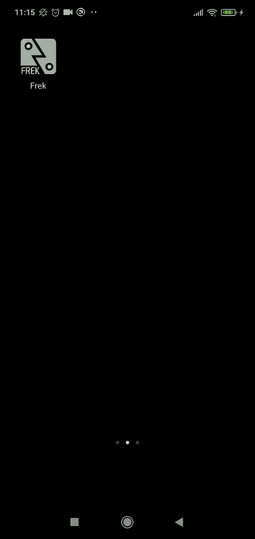
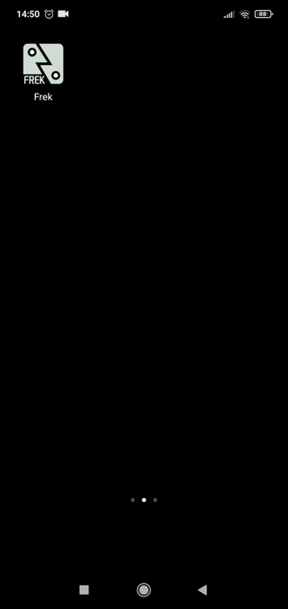
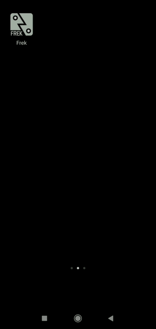
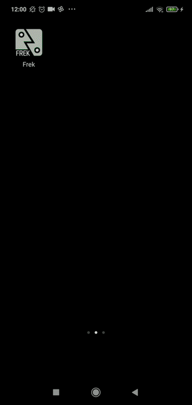

# Frek - Memorize with cards and spaced repetitions

A Flutter app to memorize with spaced repetitions.

## Features
1. *Review with spaced repetitions*: Periodically revisit learned concepts with the spaced learning technique [1] to maximize recall while minimizing time studied. Cards that are due are signaled with a blue circle. Once a card is recalled, the next review date needs to be chosen. Cards can be marked as learned, when we consider that we have permanently commited them to memory.

2. *Organize cards in collections*: Organize cards by subject, and get statistics of the number of cards learned so far.

3. *Backup*: Backup all your cards to keep them safe and restore them later.

4. *Sharing*: Share one or more cards with family and friends.

5. *Formatting text*: Change the color and style of the text to highlight words or letters. For example, I use red blue and green to highlight the gender of German nouns.

## Credits
This app was written by Etor Arza, by forking [Roshan's 'Draft' app](https://github.com/roshanrahman/flutter-notes-app).

[1] Smolen, P., Zhang, Y., & Byrne, J. H. (2016). The right time to learn: mechanisms and optimization of spaced learning. Nature reviews. Neuroscience, 17(2), 77–88. https://doi.org/10.1038/nrn.2015.18
